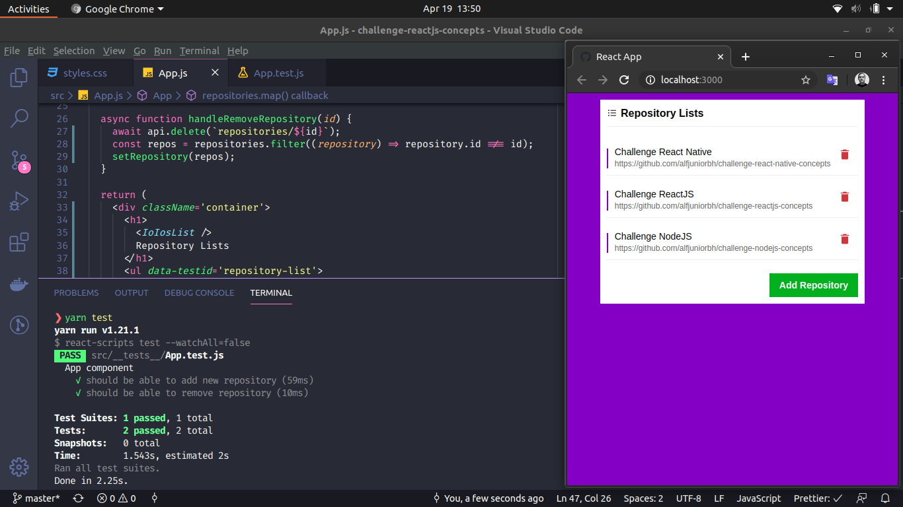

<h3 align="center">
  ReactJS Concepts Challenge
</h3>

## :rocket: About the challenge

During this project, a simple application was created with React JS and Axios to consume an API previously created in NodeJS and Express.
A simple layout using CSS and React Icons was implemented to improve the visualization of the result.

In addition, of course, to keep the tests running without interruption.

Below is a preview of how the application looks.

